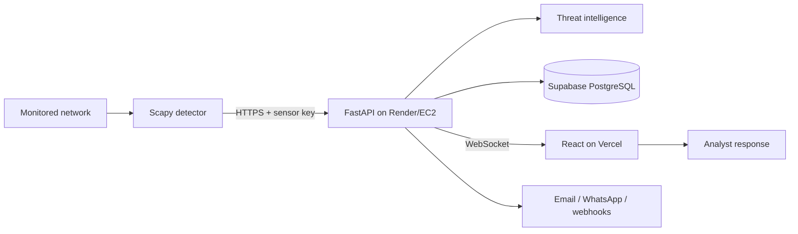

# Sentinel Network Intrusion Detection SOC

A deployment-ready Security Operations Center that captures network telemetry, detects suspicious behavior, enriches IPs with threat intelligence, streams events over WebSockets, notifies responders, and produces incident-ready PDF evidence.

## Platform capabilities

- Live React/Vite dashboard with category and severity visualizations
- FastAPI REST API, OpenAPI documentation, JWT authentication, RBAC, CORS, rate limits, and request validation
- Scapy-based detector that posts events to the API instead of writing to the database
- AbuseIPDB, VirusTotal, RDAP, GeoIP, local blacklist, service, and MITRE ATT&CK enrichment
- AI/local-XAI analyst explanations and evidence-ranked incident reports
- Email, WhatsApp/SMS, Telegram, Discord, and generic webhook notifications
- PostgreSQL/Supabase persistence with SIEM-style normalized logs
- Docker Compose, Render, Vercel, AWS-compatible containers, health checks, and Prometheus metrics

## Architecture



The detector must run on the network being monitored with packet-capture permission. Vercel hosts only the browser application. See [Architecture](docs/ARCHITECTURE.md) for trust boundaries and data flow.

## Quick start with Docker

1. Copy `.env.example` to `.env` and replace every placeholder.
2. Set a strong `POSTGRES_PASSWORD`, `JWT_SECRET`, `SECRET_KEY`, and `NID_SENSOR_API_KEY`.
3. Start the stack:

```bash
docker compose up -d --build
```

4. Open the frontend at `http://localhost:5173`, API docs at `http://localhost:8000/docs`, and health endpoint at `http://localhost:8000/health`.

For a Python-only setup and cloud deployment, follow the [Installation Guide](docs/INSTALLATION.md).

## Production deployment

| Component | Recommended target | Configuration |
| --- | --- | --- |
| Frontend | Vercel | Root `frontend`; `VITE_API_URL=https://network-intrusion-detection-wvqo.onrender.com` |
| Backend | Render or AWS EC2 | Root Dockerfile; health check `/health` |
| Database | Supabase PostgreSQL | Transaction pooler URL in `DATABASE_URL` |
| Detector | Local Linux/Windows host or EC2 | `API_URL` and `NID_SENSOR_API_KEY` |

Render can create the API directly from [render.yaml](render.yaml). Never commit `.env`, database passwords, JWT secrets, sensor keys, or provider keys. Rotate any credential that has been pasted into a chat, screenshot, issue, or commit.

## Documentation

- [Architecture and security boundaries](docs/ARCHITECTURE.md)
- [REST and WebSocket API reference](docs/API.md)
- [Installation and deployment guide](docs/INSTALLATION.md)
- [SOC analyst user manual](docs/USER_MANUAL.md)

## Verification

```bash
python -m unittest discover -s tests
cd frontend && npm ci && npm run build
```

The backend publishes liveness at `/health`, dependency status at `/api/system/health`, database health at `/database/health`, and Prometheus output at `/metrics`.

## License and scope

Use this project only on networks you own or are explicitly authorized to monitor. Automatic blocking should be enabled only after testing allowlists and recovery access.
