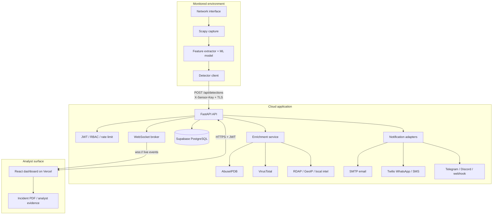

# Deployment Architecture

## Production topology

## Data flow

1. The detector captures a packet window. Empty windows are skipped; placeholder strings are never stored as IP addresses.
2. Features are transformed by the same scaler/encoder used during training.
3. A detection JSON object is sent to `POST /api/detections` using the sensor key.
4. FastAPI validates the payload, maps MITRE technique metadata, and enriches routable IPs.
5. The event and audit metadata are committed to PostgreSQL.
6. The API broadcasts the persisted event to authenticated WebSocket clients.
7. Confirmed attacks can trigger configured notification channels. Analysts can enrich, explain, notify, or export the event from the incident workbench.

## Trust boundaries

- **Sensor boundary:** packet capture stays on the monitored host. Only extracted event data leaves it.
- **Public API boundary:** all production traffic uses HTTPS. Sensor ingestion uses a dedicated key; analyst routes use short-lived JWTs.
- **Browser boundary:** the frontend receives no database or provider credentials. It receives only `VITE_API_URL`.
- **Database boundary:** use the Supabase pooler connection over TLS and restrict credentials to the backend.
- **Provider boundary:** external threat-intelligence and notification calls are server-side and optional.

## Availability and scaling

The API is stateless except for the in-process WebSocket client registry. Run one worker for guaranteed local WebSocket broadcasts. For multiple workers, add Redis pub/sub. Supabase provides managed storage; Render health checks `/health`. Use `/metrics` with Prometheus/Grafana and ship `logs/app.log` to the platform log collector.

## Production hardening checklist

- Rotate all development credentials and use platform secret stores.
- Set exact CORS origins when the Vercel production hostname is known.
- Keep `ALLOWED_HOSTS` limited to the API domain.
- Enable TLS at the reverse proxy and set `FORCE_HTTPS=1` only when forwarded-proto headers are correct.
- Apply database backups, retention, and least-privilege roles.
- Configure alert channel allowlists and test notifications.
- Pin container image versions and run dependency/security scans.
